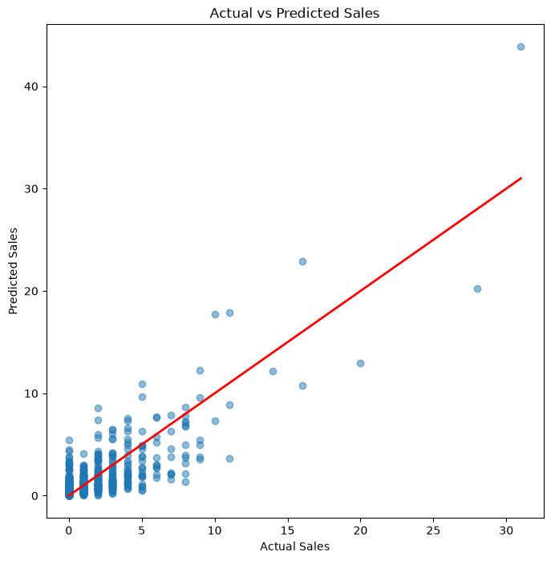
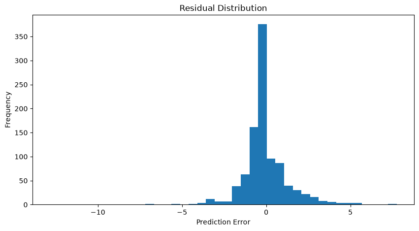

# 📈 M5 Retail Demand Forecasting using LightGBM

> An end-to-end machine learning project that forecasts daily retail product demand using the **M5 Forecasting** dataset. This project demonstrates data preprocessing, exploratory data analysis (EDA), feature engineering, model development, hyperparameter tuning and business insights for inventory optimization.

---

## 📌 Project Overview

Accurate demand forecasting helps retailers optimize inventory, reduce stockouts, minimize overstocking, and improve customer satisfaction.

In this project, I developed a machine learning pipeline using the **M5 Forecasting Accuracy** dataset to predict daily product sales using historical demand, pricing information, calendar events and engineered time-series features.

---

## 🎯 Problem Statement

Build a machine learning model capable of forecasting daily sales for retail products using:

- Historical sales
- Selling prices
- Calendar information
- Events & holidays
- SNAP program indicators
- Store & product hierarchy

The objective is to support better inventory planning and demand forecasting.

---

# 📂 Dataset

**Source:** Kaggle - M5 Forecasting Accuracy Competition

Dataset Files:

- sales_train_evaluation.csv
- calendar.csv
- sell_prices.csv

The dataset contains:

- 30,000+ products
- Multiple retail stores
- Three US states (CA, TX, WI)
- Daily sales records
- Calendar events
- Weekly selling prices

---

# 🛠️ Tech Stack

- Python
- Pandas
- NumPy
- Matplotlib
- LightGBM
- Scikit-learn
- Jupyter Notebook

---

# 🚀 Project Workflow

```text
Business Understanding
        │
        ▼
Data Cleaning
        │
        ▼
Wide → Long Transformation
        │
        ▼
Merge Calendar & Price Data
        │
        ▼
Exploratory Data Analysis
        │
        ▼
Feature Engineering
        │
        ▼
Train/Test Split
        │
        ▼
LightGBM Model
        │
        ▼
Hyperparameter Tuning
        │
        ▼
Model Evaluation
        │
        ▼
Business Insights
```

---

# 📊 Exploratory Data Analysis

The project includes analysis of:

### Store Analysis

- Total sales by store
- Revenue by store
- Average selling price

### State Analysis

- Sales by state
- Revenue by state
- Average selling price

### Product Analysis

- Top-selling products
- Highest revenue products
- Product-level sales distribution

### Category Analysis

- Sales by category
- Revenue by category
- Store-category comparison

---

# ⚙️ Feature Engineering

## Time-Series Features

- Lag 7
- Lag 28
- Rolling Mean (7 days)
- Rolling Mean (28 days)
- Rolling Standard Deviation (7 days)
- Rolling Standard Deviation (28 days)

## Price Features

- Selling Price
- Price Change
- Percentage Price Change
- Relative Price
- Average Price
- Minimum Price
- Maximum Price
- Price Range
- Discount Indicator

## Calendar Features

- Weekday
- Month
- Year
- SNAP indicators
- Event Name
- Event Type

## Categorical Features

- Store
- State
- Category
- Department

---

# 🤖 Machine Learning Model

**Model Used**

- LightGBM Regressor

### Why LightGBM?

- Fast training on large datasets
- Excellent performance on tabular data
- Handles non-linear relationships effectively
- Provides feature importance for interpretation

---

# 🔧 Hyperparameter Tuning

Hyperparameter optimization was performed using **RandomizedSearchCV**.

### Best Parameters

```python
{
    'subsample': 0.9,
    'num_leaves': 70,
    'n_estimators': 300,
    'max_depth': 20,
    'learning_rate': 0.05,
    'colsample_bytree': 1.0
}
```

The tuned model produced performance similar to the baseline, indicating that effective feature engineering had a greater impact than hyperparameter optimization.

---

# 📈 Model Performance

| Metric | Value |
|---------|------:|
| MAE | **0.899** |
| RMSE | **1.628** |
| R² Score | **0.659** |

---

# 📉 Model Evaluation

### Actual vs Predicted Sales

The model accurately captures regular sales patterns while showing larger errors during rare demand spikes.

```markdown

```

---

### Residual Distribution

Residuals are centered around zero, indicating that the model is generally unbiased with no significant systematic overprediction or underprediction.

*(Insert image here)*

```markdown

```

---

# ⭐ Feature Importance

The most influential features were:

1. Rolling Mean (7 Days)
2. Lag 7
3. Rolling Mean (28 Days)
4. Lag 28
5. Rolling Standard Deviation (7 Days)
6. Relative Price
7. Weekday
8. Month
9. Selling Price

These results demonstrate that **historical demand is the strongest predictor of future sales**.

---

# 💡 Business Insights

- Historical sales patterns were the strongest drivers of future demand.
- Relative pricing influenced customer purchasing behavior.
- Weekly seasonality affected sales performance.
- Demand varied across stores and states.
- Promotional events had a moderate impact compared to historical demand.

---

# 📌 Business Recommendations

- Increase inventory before expected demand peaks.
- Use rolling demand trends for replenishment planning.
- Monitor relative pricing instead of absolute pricing.
- Combine demand forecasts with promotional calendars.
- Retrain the forecasting model periodically using the latest sales data.

---

# 📁 Project Structure

```text
M5_Forecasting_Model/
│
├── data/
│   ├── raw/
│   └── processed/
│
├── notebooks/
│   ├── 01_Data_Understanding.ipynb
│   ├── 02_EDA.ipynb
│   ├── 03_Feature_Engineering.ipynb
│   ├── 04_Model_Training.ipynb
│
├── images/
│
├── README.md
│
├── requirements.txt
│
└── src/
```

---

# 🔮 Future Improvements

- Train on the complete M5 dataset
- Compare LightGBM with CatBoost and XGBoost
- Implement time-series cross-validation
- Build an interactive Streamlit dashboard
- Deploy the forecasting model using FastAPI

---

# 📚 Key Learnings

Through this project, I gained practical experience in:

- Large-scale data preprocessing
- Time-series feature engineering
- Retail demand forecasting
- Gradient boosting algorithms
- Hyperparameter tuning
- Model evaluation
- Translating machine learning results into business insights

---

# 👨‍💻 Author

**Chandra Prakash Pandey**

**Data Analyst | Python | SQL | Power BI | Machine Learning**

📧 *cppandey497@gmail.com*

🔗 *https://www.linkedin.com/in/chandra-prakash-pandey497/*

💻 *https://github.com/cppandey497*

---

## ⭐ If you found this project useful, please consider giving the repository a star!